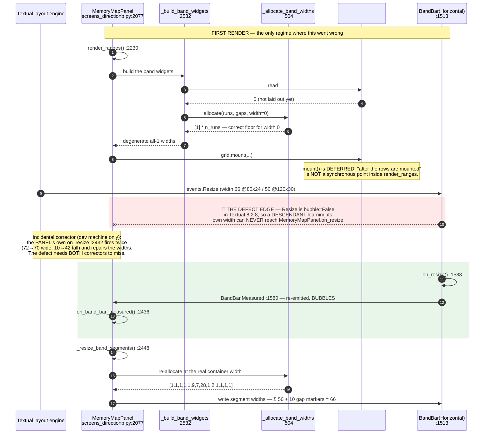
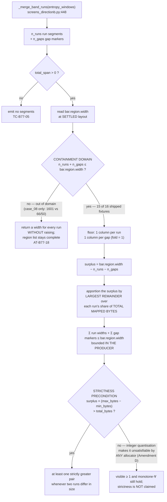

# Diagrams — s19_app — Batch `2026-08-01-batch-77`

> Phase-6 artifact. Owner: `docs-writer`. Audience: technical stakeholder / a future maintainer of `MemoryMapPanel`.
> **Why these exist:** the Phase-5 architect evidence checklist recorded *"Diagram included when flow is non-trivial — ✗/partial. No mermaid diagram was produced … Flagged: a two-corrector recovery path where the defect needs both to miss is exactly the flow that warrants a diagram."* (`05-postmortem.md:251`). This file closes that gap.
> **All line numbers verified on disk at `244ecf2`**, not carried from the specification. The specification's own symbol lines had drifted by up to ~450 lines by close (`05-postmortem.md:242`); the numbers below were re-derived.

---

## 1. Render-and-settle — where the batch's one product defect lived

This is the load-bearing diagram. The batch's single genuine defect in shipped product code lives on **one edge** of it: `events.Resize` is declared `bubble=False` in Textual 8.2.8, so a *descendant* that learns its own width can never notify the panel that owns the apportionment.

### Reading the diagram

| Element | Meaning |
|---|---|
| 🛑 red band, `--x` edge | **The defect.** `events.Resize` does not bubble, so the bar's own resize is invisible to the panel. Before the fix this edge was the *only* path that carried the settled width, and it was severed. |
| Grey note, "incidental corrector" | `MemoryMapPanel.on_resize` (`:2432`) fires when the **panel** changes size. On the dev machine it fired twice and repaired the widths, which is why every local run was green. On a slower machine it did not fire in time. **The defect required both correctors to miss.** |
| ✅ green band | **The fix.** `BandBar` re-emits its own `Resize` as `BandBar.Measured` (`:1580`), a message that *does* bubble. The panel handles it at `:2436` and calls the pre-existing `_resize_band_segments`. |

### Three properties of the fix, all measured

| Property | Evidence |
|---|---|
| **Event-driven, not timing-guessed** | No retry count was raised and no pause was added. The correction is driven by the event that carries the information — the bar learning its own width — however many frames that takes. A timing guess would leave the bug live on any machine slower than the one it was tested on, *which is precisely how this reached the merge gate.* |
| **Cannot spin** | `.map-band-bar` is `width: 100%` (`s19_app/tui/styles.tcss:798`) and `Horizontal` does not scroll, so the bar's width is **content-independent** — rewriting segments can never re-deliver `Resize`. Measured by the merge-gate reviewer: 14 segments forced to 40 columns each (560 columns of content in a 66-column bar) left `bar.region.width` at 66 and posted **0** `Measured`. Idempotence: 6 writes while settling, then **0** across 30 steady frames and **0** under 5 forced re-apportionments at a stable width. |
| ⚠️ **The spin proof's stated reason was wrong first** | `BandBar`'s docstring originally credited `_resize_band_segments`' idempotence guard. That reason does not cover the case that actually occurs — during settle the widths genuinely differ and 4–6 writes genuinely happen, and no spin follows anyway. Corrected at `bfddcc9` (finding F2). **Load-bearing warning: changing `.map-band-bar` to `width: auto` would CLOSE the loop**, and since the settle path performs genuinely non-no-op passes the cycle would be live, not hypothetical. |

> **Coverage limit, stated rather than implied.** The regression node `AT-B77-19` (`tests/test_tui_map_big.py:2734`, `test_b77_bar_reapportions_without_panel_resize_or_retry`) guards **first render only**. Re-render, terminal resize, screen switch and resize-while-inactive were all verified correct but are **unguarded**. They all ride this same `Resize → Measured` mechanism. Carried as finding **F-3 / gap G-005** into `.dev-flow/BACKLOG-CODE.md`.

---

## 2. Allocation — one column per run, the surplus by largest remainder, bounded in the producer

### Why the two conditions are different

| Clause | Domain it holds on | Why |
|---|---|---|
| `visible ≥ 1` for every run · `Σ ≤ width` · monotone-∀ over ordered pairs | `n_runs + n_gaps ≤ bar.region.width` | The containment domain. Costs nothing to hold at the boundary. |
| **strict-∃** (at least one strictly greater pair when two runs differ in mapped size) | **additionally** `surplus × (max_bytes − min_bytes) > total_bytes` | **Amendment D — the requirement was FALSE, not loose.** Two runs of different but *similar* mapped size legitimately round to the same integer column count. A size difference smaller than one column's worth of bytes cannot be represented in integer columns, so **no implementation can discriminate them.** Executed in-domain counterexample: `runs=[1,2,4,…,512]`, `n_gaps=9`, `bar=19` → `widths=[1]*10`, `differing=True`, `strict=False`. |

⚠️ **The threshold is strict (`>`, never `≥`), and only exhaustive enumeration establishes that.** `≥` admits **285** non-strict cases at ratio exactly `1.000000000` (e.g. `runs=[1,4,4]`, `n_gaps=0`, `bar=6` → `[2,2,2]`) — a measure-zero boundary a 140 808-case random sweep never hit. Consolidated verification: **859 276** in-domain cases, **0** counterexamples, independently re-run at 6.5 M.

⚠️ **`_allocate_band_widths` was NOT modified to chase the strictness clause.** Chasing an unsatisfiable clause in the allocator would have been chasing a target that cannot be hit. The fix was to the *requirement*.

> **The design principle the flowchart encodes:** *an output-shaped predicate cannot bound an allocation.* `AT-B77-03` (nothing paints outside the bar) is output-shaped — it **detects** an overflow but cannot **prevent** one. Executed: with the container basis and a 1-column fold but no producer-side bound, `prg.s19` emits **60 columns into a 50-column bar** while still leaving 5 runs invisible. With the bound, `prg.s19` fits **exactly** at both regimes with zero aggregation. This is batch-74's asset restated on a third surface.

---

## Provenance

| Fact in these diagrams | Verified how |
|---|---|
| All `screens_directionb.py` line numbers | `grep -n` on the working tree at `244ecf2` |
| `.map-band-bar { width: 100%; }` | `s19_app/tui/styles.tcss:798` |
| `AT-B77-19` node name and line | `tests/test_tui_map_big.py:2734` |
| The width vector `[1,1,1,1,1,9,7,28,1,2,1,1,1,1]`, Σ 56 + 10 gaps = 66 | `04-validation.md` §Escaped-bug regression; the `2f427a9` gate run's own output |
| `bubble=False` on `events.Resize` | Textual 8.2.8, traced at the merge-gate fix; recorded `04-validation.md:302` |
| Amendment D's figures | `01-requirements.md` §6.5 Amendment D and `:876` |
