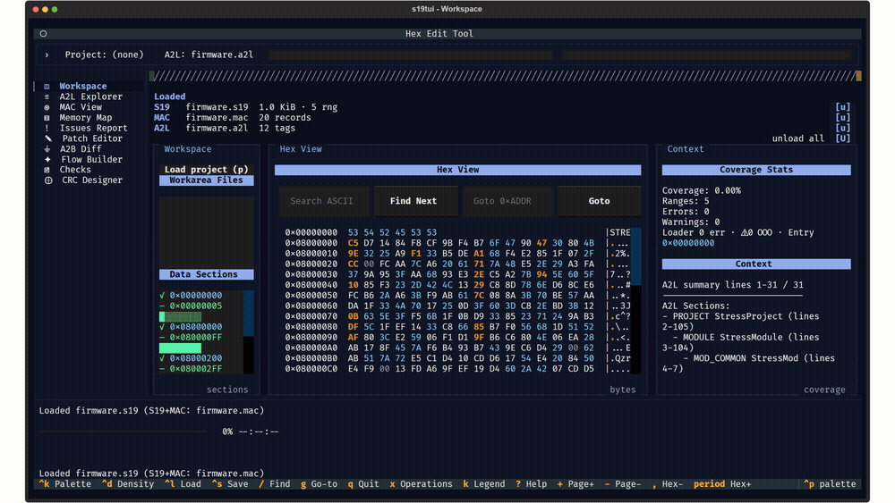
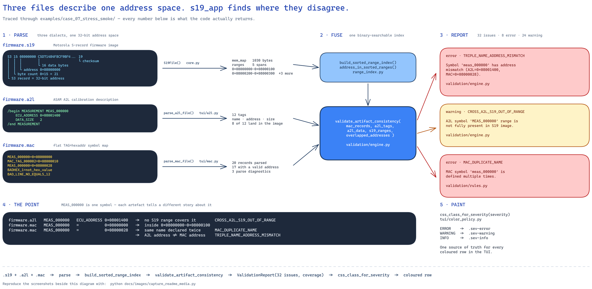
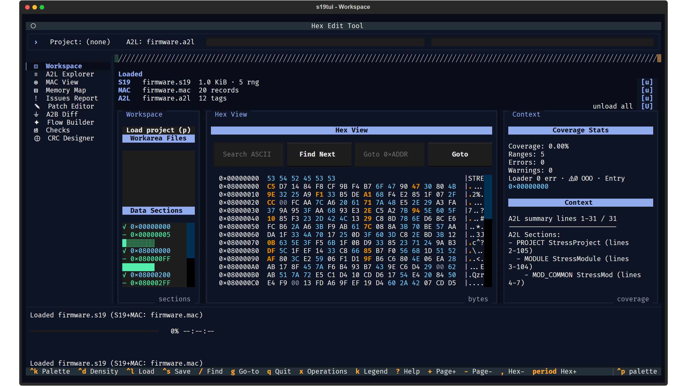
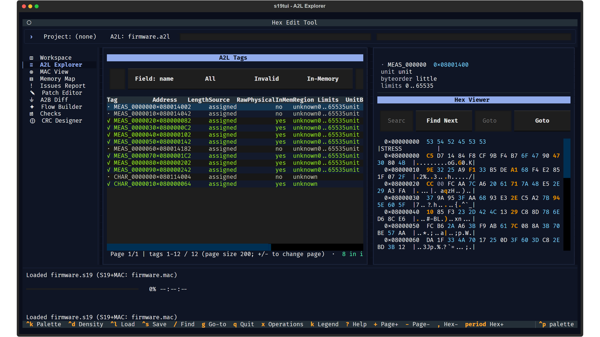
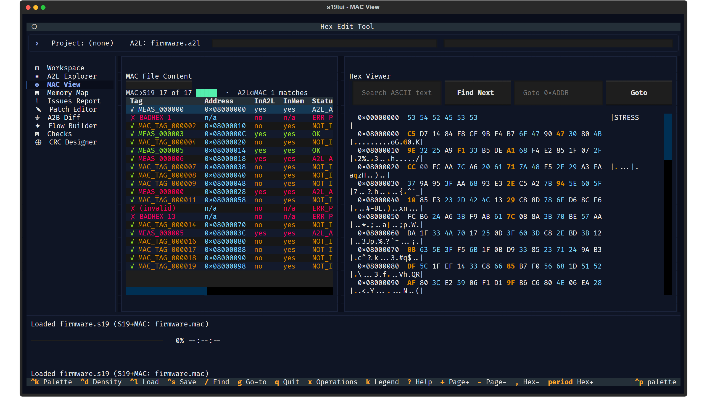
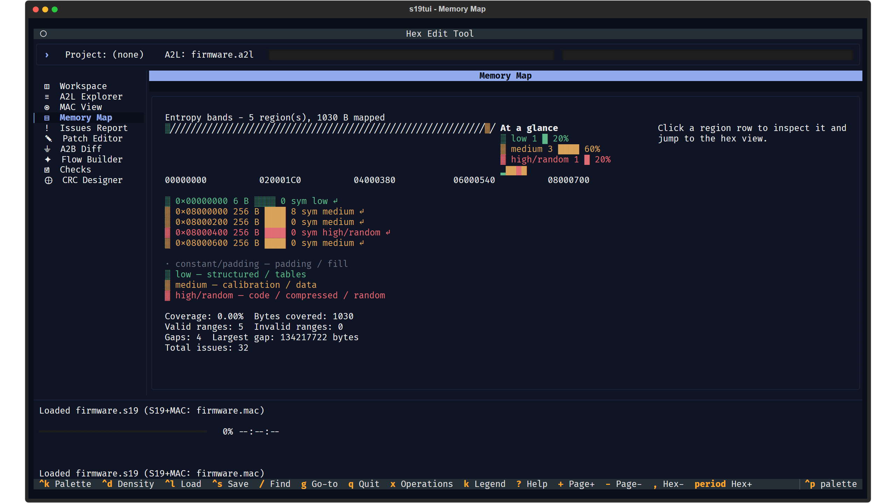
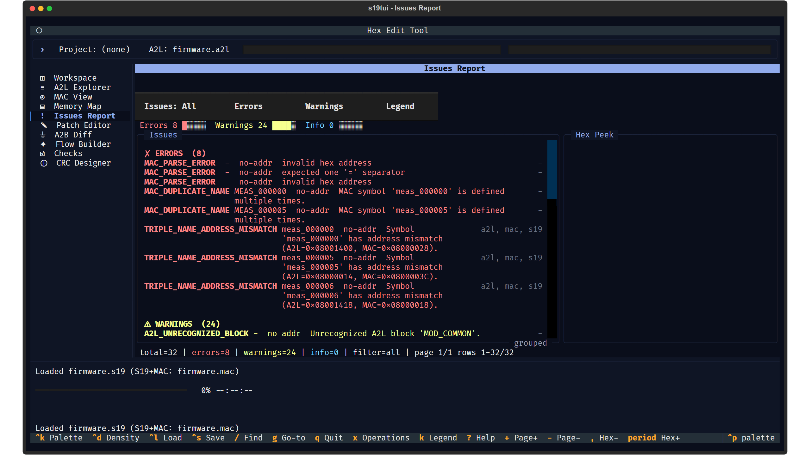

# s19_app — S19 / Intel HEX / A2L / MAC workbench

An **offline terminal workbench for automotive firmware artefacts**. It parses a
flash image (Motorola S-record or Intel HEX), the ASAM **A2L** file that
describes the calibration symbols inside it, and the **MAC** (`TAG=hexaddr`)
symbol map — then cross-checks all three against one another and shows you every
place they disagree.

No GUI, no daemon, no network calls, no external services. Everything runs
locally in a terminal against files on disk.

Distribution name `s19tool`; the terminal UI is `s19tui`.

<p align="center">
  
</p>

<sub>Real capture: each frame is a native Textual SVG export from a headless
`S19TuiApp` loaded with `examples/case_07_stress_smoke/`. Regenerate with
`python docs/images/capture_readme_media.py`.</sub>

---

## Why it exists

An ECU flash image, its A2L description and its MAC symbol map are produced by
different tools at different times. They routinely drift apart: a symbol moves,
an A2L is regenerated against a build that never shipped, a MAC is hand-edited.
Individually each file looks fine. The damage only shows up when you fuse them
into one address space and ask which claims actually hold.

That fusion is what this tool does.



<sub>Open the image full size to read it. Every name, address, issue code and
count above is taken from running the code over
`examples/case_07_stress_smoke/`.</sub>

The three parsers each collect failures rather than aborting, so a malformed
record never costs you the rest of the file. The results converge on
`s19_app/validation/engine.py::validate_artifact_consistency`, which returns a
`ValidationReport` of `ValidationIssue` records. Issue codes
(`CROSS_MAC_S19_OUT_OF_RANGE`, `TRIPLE_NAME_ADDRESS_MISMATCH`, …) are a public
contract — the test suite asserts on them.

---

## Install

Requires **Python 3.11 or newer** — that is what CI runs, and
`s19_app/cli.py` uses PEP 604 unions, which need 3.10+. (`pyproject.toml`
still declares `requires-python = ">=3.8"`; that bound is stale.)

```bash
git clone https://github.com/jav201/s19_app.git
cd s19_app
python -m venv .venv
.\.venv\Scripts\Activate.ps1      # Windows;  source .venv/bin/activate on Linux/macOS
pip install -e .
```

This installs one console script, **`s19tui`**. For the snapshot-testing extra:

```bash
pip install -e ".[dev]"
```

---

## The TUI — `s19tui`

```bash
s19tui
s19tui --load examples/case_07_stress_smoke/firmware.s19
```

A left activity rail switches between ten single-context screens, bound to keys
`1`–`0`.

| Key | Screen |
|----|--------|
| `1` | Workspace — sections · hex · context |
| `2` | A2L Explorer — symbol table + hex pane |
| `3` | MAC View — record table + hex pane |
| `4` | Memory Map — coverage + entropy bands |
| `5` | Issues Report — validation findings |
| `6` | Patch Editor — parameter + memory change-set, CDFX export |
| `7` | A2B Diff — compare two images, emit a diff report |
| `8` | Flow Builder |
| `9` | Checks |
| `0` | CRC Designer |

Other bindings: `Ctrl+K` palette · `Ctrl+D` density · `Ctrl+L` load ·
`Ctrl+S` save project · `/` find · `g` go-to address · `p` load project ·
`x` operations · `k` legend · `?` help · `q` quit.

### Workspace

Sections list with per-range validity, the hex/ASCII view, and live coverage
stats.



### A2L Explorer

Each A2L symbol resolved against the loaded image. Green rows are present in
memory; grey rows are not — here `MEAS_000000` at `0x08001400` falls outside
every S19 range, so it reads `no` under **InMem**.



### MAC View

The MAC map cross-checked against both the image and the A2L. Note
`MEAS_000000` appearing twice with two different addresses, and the malformed
lines flagged rather than dropped.



### Memory Map

Region coverage with entropy banding — a quick read on which regions look like
code, calibration data or padding.



### Issues Report

Everything the validation engine found, grouped by severity. For this fixture:
32 issues, 8 errors, 24 warnings.



### Workarea

The TUI keeps its own on-disk area next to where you launched it:

| Path | Holds |
|------|-------|
| `.s19tool/workarea/temp/` | transient loads |
| `.s19tool/workarea/<project>/` | saved projects (one image + one MAC + one A2L) |
| `.s19tool/logs/s19tui.log` | TUI log, 5 MB rotating |

---

## The CLI — deprecated

> **This is not the interface to build on. `s19tui` is.**
> The CLI is **slated for removal** and is already half-gone: its console script was
> deleted from `pyproject.toml`, so there is no `s19tool` command. What remains runs only
> as a module. It is documented here so that anyone who finds a reference to it knows
> what it is and what replaced it — not as a supported surface.

```bash
python -m s19_app.cli <subcommand> <file>
```

The subcommand comes *before* the file path — the reverse of what older docs show.

<details>
<summary>Remaining subcommands, for reference</summary>

```bash
# General info
python -m s19_app.cli info examples/case_01_basic_valid/firmware.s19

# Checksums, overlaps, record ordering
python -m s19_app.cli verify examples/case_01_basic_valid/firmware.s19

# Memory layout
python -m s19_app.cli layout examples/case_01_basic_valid/firmware.s19
python -m s19_app.cli ranges examples/case_01_basic_valid/firmware.s19
python -m s19_app.cli gaps   examples/case_01_basic_valid/firmware.s19

# Hex dump
python -m s19_app.cli dump examples/case_01_basic_valid/firmware.s19 --start 0x80000000 --length 48
python -m s19_app.cli dump-all      examples/case_01_basic_valid/firmware.s19
python -m s19_app.cli dump-by-range examples/case_01_basic_valid/firmware.s19 --output memory.txt

# Patching
python -m s19_app.cli patch-str examples/case_01_basic_valid/firmware.s19 \
    --addr 0x80000000 --text "HELLO" --save-as modified.s19
python -m s19_app.cli patch-hex examples/case_02_gaps_and_patch_targets/firmware.s19 \
    --addr 0x80010080 --bytes "DE AD BE EF" --save-as modified.s19

# Version
python -m s19_app.cli version
```

`dump` produces:

```
0x80000000  53 31 39 54 4F 4F 4C 5F 42 41 53 49 43 00 01 02  | S19TOOL_BASIC...
0x80000010  03 00 01 02 03 04 05 06 07 08 09 0A 0B 0C 0D 0E  | ................
0x80000020  0F                                               | .
```

Full subcommand list: `info`, `layout`, `ranges`, `gaps`, `version`, `verify`,
`update-checksums`, `dump`, `dump-by-range`, `dump-all`, `patch-str`,
`patch-hex`, `save`.

</details>

Every one of these has an equivalent in the TUI, which is where the work has gone.

---

## Formats

All open, publicly specified formats. None of them is vendor-private.

| Format | Owner / standard | Also seen as | Parser |
|--------|------------------|--------------|--------|
| Motorola S-record | Motorola, mid-1970s | `.s19` `.s28` `.s37` `.s` `.s1` `.s2` `.s3` `.sx` `.srec` `.mot` `.exo` `.mxt` | `s19_app/core.py` |
| Intel HEX | Intel | `.hex` `.ihex` | `s19_app/hexfile.py` |
| A2L | **ASAM MCD-2 MC**, also called ASAP2 | `.a2l`, plus its `.aml` companion | `s19_app/tui/a2l.py` |
| MAC symbol map | no branded standard — see below | `.mac` and equivalents | `s19_app/tui/mac.py` |
| CDF 2.0 | **ASAM MCD-2 CAL** | `.cdfx` | `s19_app/tui/cdfx/` |

**On the S-record family.** `S19`, `S28` and `S37` are the same format at three
address widths — 16-bit (up to 64 KB), 24-bit (16 MB) and 32-bit (4 GB). The many
extensions above are conventions, not different formats.

**Extensions do not gate anything here.** Neither `core.py` nor the load service
inspects the filename; the parsers key on record structure. A `.mot` or `.srec`
file loads exactly like a `.s19`.

**On MAC.** This is the one entry that is a *shape* rather than a named standard:
a flat text listing of `TAG=hexaddr` lines. Different toolchains emit an
equivalent symbol→address map under different names and extensions, and the
parser reads the shape rather than claiming a particular vendor's format.

**A2L belongs to ASAM, not to any tool vendor.** ASAM MCD-2 MC has been public
since 1999 (current revision 1.7.1, 2018). Vendor tools such as Vector CANape and
vCDM *consume* A2L and CDFX; they do not own them, and this project is written
against the published standards rather than against any vendor's implementation.

### Provenance

This tool was built from **public specifications and public documentation only**.
Every fixture under `examples/` is synthetic and generated in-repo, and the
screenshots and GIF in this README are rendered from those fixtures — see
[`docs/images/capture_readme_media.py`](docs/images/capture_readme_media.py),
whose stated policy is that it may only ever read from `examples/`.

**No employer, customer or otherwise proprietary artefact appears anywhere in
this repository**, and none was used to build it.

---

## Example fixtures

`examples/` carries synthetic S19 / A2L / MAC triples, each built to exercise a
different failure mode. They are also the inputs the test suite and the
screenshots above use.

| Case | Exercises |
|------|-----------|
| `case_01_basic_valid` | clean baseline — verify passes, no overlaps |
| `case_02_gaps_and_patch_targets` | gaps plus explicit patch targets |
| `case_03_overlapping_records` | records writing the same addresses |
| `case_04_bad_checksums` | checksum failures |
| `case_05_dense_mixed_content` | dense mixed content |
| `case_06_large_nested_a2l` | deeply nested / large A2L |
| `case_07_stress_smoke` | the full end-to-end pipeline — every cross-artefact rule |
| `case_00_public` | public A2L samples (ASAP2 demo files) + `MANIFEST.md` |

`examples/professional_validation/` holds a second suite of seven cases
(baseline, patch targets, overlaps, bad checksums, out-of-order records,
cross-reference inconsistencies, heavy fragmentation).

---

## Tests

```bash
pytest -q                    # everything
pytest -q -m "not slow"      # skip the perf smoke tests
pytest -q -m "not snapshot"  # skip the layout-drift SVG baselines
```

`pytest --collect-only -q` reports **2227 collected tests**. CI
(`.github/workflows/tui-ci.yml`) runs the lean suite on pull requests and the
full suite on pushes to `main` / `main-tui`, on Python 3.11.

---

## Known rough edges

Things you will hit if you follow this README, stated plainly rather than
papered over:

- `project.toml` at the repo root is a pre-PEP-621 leftover. The build reads
  `pyproject.toml` only.

**On the deprecated CLI**, kept here for anyone who still runs it. These are not
TUI defects and are not being fixed — the surface is going away:

- **No `s19tool` console script.** `pyproject.toml` registers only `s19tui`
  (deliberately — commit `3a55416`). Use `python -m s19_app.cli`.
- **`verify` crashes on a non-UTF-8 console when it has failures to print.**
  `cli.py` writes a `❌` and Windows `cp1252` consoles raise
  `UnicodeEncodeError` — so it fails exactly when it has something to tell you.
  Workaround: `PYTHONIOENCODING=utf-8`.
- **`dump` at an unmapped address prints blank rows** instead of saying nothing
  is mapped there. Check `ranges` first.
- **`dump-by-range --output` writes ANSI colour escapes into the file.**

---

## Documentation

| Document | Covers |
|----------|--------|
| [docs/overview.md](docs/overview.md) | what it is, who it is for, current capabilities |
| [docs/architecture.md](docs/architecture.md) | the three layers, TUI shell, `cdfx/` package, safety contracts |
| [docs/diagrams/architecture.md](docs/diagrams/architecture.md) | living Mermaid architecture diagrams |
| [REQUIREMENTS.md](REQUIREMENTS.md) | `R-*` requirement traceability |
| [CLAUDE.md](CLAUDE.md) | conventions, commands, layer rules |
| [PROJECT_RULES.md](PROJECT_RULES.md) | docstring and function-design contract |

---

## Licence

MIT, declared in `pyproject.toml`. There is no `LICENSE` file in the repository
yet.
