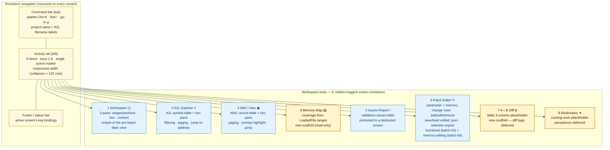
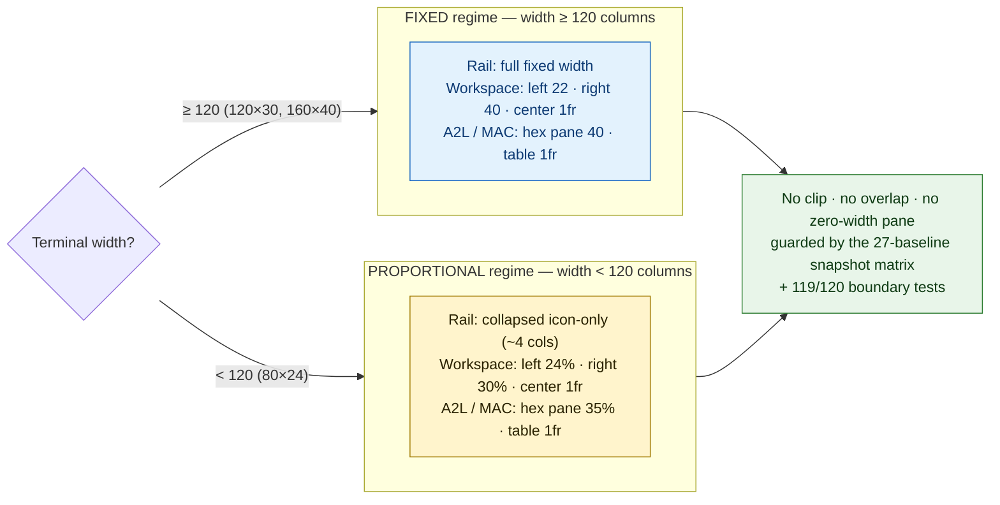
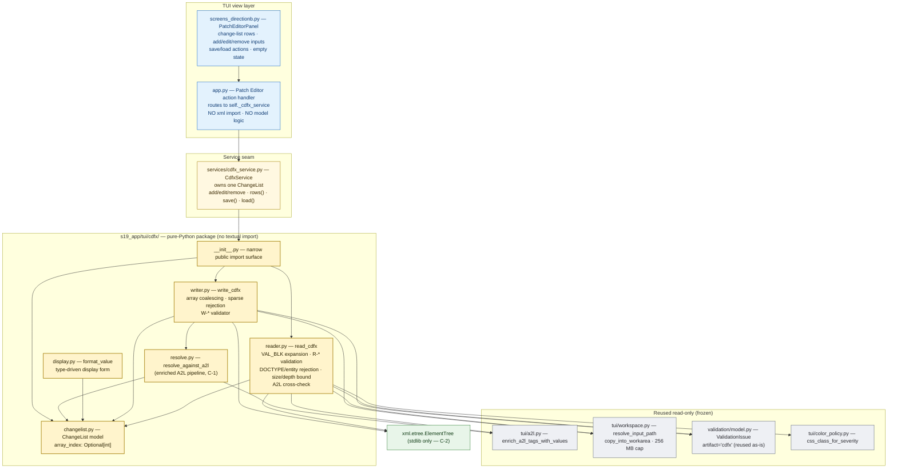
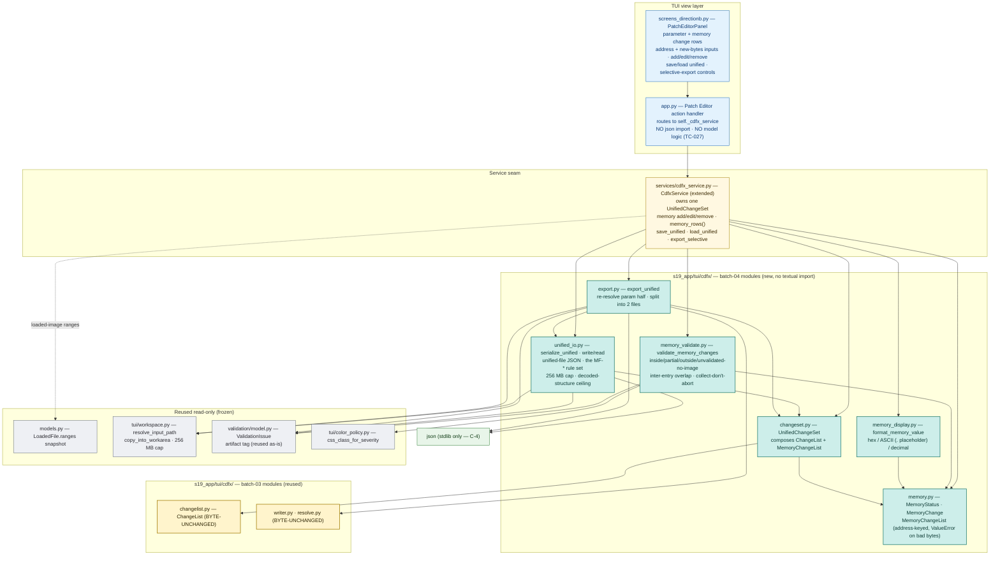

# s19_app — Architecture (living diagram)

> **Canonical living architecture diagram for `s19_app`.** Keep this file current
> as the codebase evolves. Per-batch dev-flow archives keep their own point-in-time
> copy under `.dev-flow/<batch>/06-docs/diagrams/`; this file is the authoritative
> up-to-date view.
>
> Last updated: batch `2026-05-21-batch-04` (memory-value editing + unified
> change-set + selective export). All diagrams are Mermaid source — render in
> any GitHub Markdown viewer or Mermaid-aware IDE. No build step, no rendered
> images checked in.

`s19_app` (distribution name `s19tool`) is an offline desktop tool for parsing,
validating and visualising automotive memory artefacts — S-record / Intel HEX
firmware images, ASAM A2L description files, and MAC `TAG=hexaddr` symbol files.
It ships two entry points (`pyproject.toml`):

- **`s19tool`** → `s19_app.cli:main` — a Rich-formatted CLI (`info`, `verify`,
  `dump`, `patch-hex`).
- **`s19tui`** → `s19_app.tui:main` — a Textual TUI for interactive exploration
  plus cross-artefact validation. As of batch-02 the TUI uses the **Direction B**
  layout: a left activity rail + a top command bar + eight single-context screens.

The codebase has three layers (per [`CLAUDE.md`](../../CLAUDE.md) §Architecture):
**parsers → range/validation engine → TUI services + view**.

---

## 1. System architecture

The three-layer model with the Direction B TUI on top. Batch-02 (the Direction
B restyle) added the rail, command bar and eight screens; batch-03 added the
**CDFX package** and the **`cdfx_service`** seam — a data-processing layer that
makes the Patch Editor functional; batch-04 **extended that same `cdfx`
package** with the memory-value-editing / unified-change-set / selective-export
layer (six new modules — see §5). The dashed red line is the engine-freeze
boundary that **every** batch honoured: the parsing/validation engine is
unchanged (zero bytes changed below it), and batch-04 additionally left the
batch-03 CDFX writer/resolver byte-unchanged. The batch-03 CDFX feature and the
batch-04 memory layer are purely additive new files.

```mermaid
flowchart TB
    subgraph entry["Entry points (pyproject.toml)"]
        cli["s19tool CLI<br/>s19_app.cli:main<br/>info · verify · dump · patch-hex"]
        tui["s19tui TUI<br/>s19_app.tui:main"]
    end

    subgraph viewDB["TUI view layer — Direction B (batch-02)"]
        app["tui/app.py — S19TuiApp<br/>orchestration-only<br/>BINDINGS · screen routing · density<br/>Patch Editor action handler"]
        styles["tui/styles.tcss<br/>Calm Dark theme · 5 sev-* rules<br/>two-regime responsive layout"]
        rail["tui/rail.py — Rail / RailItem<br/>8 items · keys 1-8 · glyphs+ASCII"]
        cmdbar["tui/command_bar.py — CommandBar<br/>palette Ctrl+K · find / · go-to g<br/>project + A2L labels"]
        dbscreens["tui/screens_directionb.py<br/>Memory Map · A↔B Diff · Bookmarks scaffolds<br/>Patch Editor — now functional (batch-03)"]
        screens["tui/screens.py<br/>Load / Save / Project modals"]
        hexview["tui/hexview.py<br/>render_hex_view_text · find_string_in_mem<br/>MAX_HEX_BYTES / MAX_HEX_ROWS caps"]
        models["tui/models.py — LoadedFile snapshot"]
        workspace["tui/workspace.py<br/>copy_into_workarea · validate_project_files<br/>resolve_input_path · setup_logging · .s19tool/ workarea"]
    end

    subgraph services["Layer 3a — TUI services (orchestration boundary)"]
        loadsvc["services/load_service.py<br/>build_loaded_s19 / build_loaded_hex"]
        a2lsvc["services/a2l_service.py<br/>enrich_tags_and_render"]
        valsvc["services/validation_service.py<br/>build_validation_report"]
        cdfxsvc["services/cdfx_service.py — CdfxService<br/>(batch-03, extended batch-04)<br/>owns one UnifiedChangeSet<br/>parameter + memory ops · rows()<br/>save/load_unified · export_selective"]
    end

    subgraph cdfxpkg["cdfx package — s19_app/tui/cdfx/ (pure-Python, no Textual)"]
        cchangelist["changelist.py<br/>ChangeList model · array_index Optional[int]"]
        cresolve["resolve.py<br/>resolve_against_a2l"]
        cdisplay["display.py<br/>format_value — type-driven display"]
        cwriter["writer.py<br/>write_cdfx · array coalescing · W-* validator"]
        creader["reader.py<br/>read_cdfx · VAL_BLK expansion<br/>R-* validation · XML-safety · A2L cross-check"]
        cmemory["memory.py · memory_validate.py · memory_display.py<br/>MemoryChangeList · range validation<br/>hex/ASCII/decimal display (new, batch-04)"]
        cunified["changeset.py · unified_io.py · export.py<br/>UnifiedChangeSet · unified-file JSON I/O · MF-* rules<br/>selective export (new, batch-04)"]
    end

    subgraph parsers["Layer 1 — Parsers"]
        core["core.py — S19File / SRecord"]
        hexfile["hexfile.py — IntelHexFile"]
        a2l["tui/a2l.py — A2L parse / extract / render<br/>(+ a2l_* facades)"]
        mac["tui/mac.py — parse_mac_file"]
    end

    subgraph engine["Layer 2 — Range / validation engine"]
        rangeidx["range_index.py<br/>build_sorted_range_index<br/>address_in_sorted_ranges"]
        engineCore["validation/engine.py<br/>validate_artifact_consistency"]
        rules["validation/rules.py — per-artefact rules"]
        model["validation/model.py<br/>ValidationIssue / Severity / CoverageMetrics"]
        colorpolicy["tui/color_policy.py<br/>SEVERITY_CLASS_MAP — sev-* source of truth"]
    end

    cli -.-> core
    cli -.-> hexfile
    tui --> app

    app --- styles
    app --> rail
    app --> cmdbar
    app --> dbscreens
    app --> screens
    app --> hexview
    app --> workspace
    app --> models
    rail -->|"key/click → action_show_screen"| dbscreens
    cmdbar -->|"find → find_string_in_mem"| hexview
    cmdbar -->|"go-to → _handle_goto"| hexview

    app --> loadsvc
    app --> a2lsvc
    app --> valsvc
    app --> cdfxsvc
    dbscreens -->|"Patch Editor action"| app

    loadsvc --> core
    loadsvc --> hexfile
    a2lsvc --> a2l
    valsvc --> engineCore

    cdfxsvc --> cchangelist
    cdfxsvc --> cresolve
    cdfxsvc --> cdisplay
    cdfxsvc --> cwriter
    cdfxsvc --> creader
    cdfxsvc --> cmemory
    cdfxsvc --> cunified
    cresolve --> a2l
    creader --> a2l
    cwriter --> workspace
    creader --> workspace
    cwriter --> model
    creader --> model
    creader --> colorpolicy
    cunified --> cmemory
    cunified --> cchangelist
    cunified --> cwriter
    cunified --> cresolve
    cunified --> workspace
    cunified --> model
    cmemory --> model

    hexview --> models
    workspace --> models
    engineCore --> rules
    engineCore --> rangeidx
    engineCore --> model
    rules --> model
    colorpolicy --> model

    classDef viewNode fill:#e3f2fd,stroke:#1565c0,color:#0d3a73
    classDef svcNode fill:#fff8e1,stroke:#a07a00,color:#3a2900
    classDef engineNode fill:#e8f5e9,stroke:#2e7d32,color:#0e3a13
    classDef parserNode fill:#f3e5f5,stroke:#6a1b9a,color:#3a0d52
    classDef cdfxNode fill:#fff4cc,stroke:#a07a00,stroke-width:1.5px,color:#2a2200
    classDef memNode fill:#cdeeea,stroke:#1f7a6e,stroke-width:1.5px,color:#0d3a34
    classDef ancillary fill:#eef0f4,stroke:#5b6473,color:#2a2a30

    class app,styles,rail,cmdbar,dbscreens,screens,hexview,models,workspace viewNode
    class loadsvc,a2lsvc,valsvc,cdfxsvc svcNode
    class core,hexfile,a2l,mac parserNode
    class rangeidx,engineCore,rules,model,colorpolicy engineNode
    class cchangelist,cresolve,cdisplay,cwriter,creader cdfxNode
    class cmemory,cunified memNode
    class cli ancillary
```

**Reading the diagram.**

- **Solid arrows** = routed call (the orchestration contract). `app.py` is
  intentionally orchestration-only — parsing/enrichment/validation go through
  the three `tui/services/`.
- **Dashed arrows** from the CLI = the CLI reaches the parsers directly; it does
  not use the TUI services (it is a separate, simpler consumer).
- `tui/models.py::LoadedFile` is the worker→UI thread snapshot every renderer
  reads. Renderers must not parse files — that contract is preserved.
- The five `sev-*` CSS classes are derived from `color_policy.SEVERITY_CLASS_MAP`,
  the single source of truth for severity colours.
- **Gold nodes** = the batch-03 CDFX modules in `s19_app/tui/cdfx/`; **teal
  nodes** = the batch-04 memory-value-editing / unified-change-set modules added
  to the **same** package. The package is a pure-Python data-processing layer
  reached only through the `cdfx_service` seam — it imports
  `xml.etree.ElementTree` and `json` (both stdlib, no new dependency),
  `validation/`, and the A2L / workspace helpers, but **never `textual`**. See
  §4 (CDFX) and §5 (the memory / unified-change-set layer).
- The CDFX feature and the memory layer are **purely additive new files**; the
  parsing/validation engine is unchanged (`git diff main` empty across
  `core.py`, `hexfile.py`, `range_index.py`, `validation/`, `tui/a2l.py`,
  `tui/mac.py`), and batch-04 additionally left the batch-03 CDFX
  `writer.py` / `resolve.py` byte-unchanged.

---

## 2. Direction B TUI shell

The Direction B view layer in detail — the navigation surfaces and the eight
single-context screens. The eight screens are **sibling containers toggled by
the `.hidden` CSS class** (not `push_screen` stacks), so the rail and command
bar stay persistently mounted.

**Reading the diagram.**

- **Yellow nav nodes** = the persistent rail / command bar / footer — present on
  every screen.
- **Blue screens** = working screens with real data wiring — the batch-02
  restyles (Workspace, A2L Explorer, MAC View, Issues Report) plus the **Patch
  Editor**, made functional by batch-03 (parameter change-list rows,
  add/edit/remove inputs, `.cdfx` save/load — see §4) and extended by batch-04
  (raw-memory change rows, unified-file save/load, selective export — see §5).
- **Gold screens** = scaffolds still awaiting their logic. Memory Map renders
  real data; A↔B Diff and Bookmarks are placeholders — diff computation and
  bookmark persistence are deferred to follow-up batches.
- The pre-batch three-layout toggle (`#main_layout` / `#alt_layout` /
  `#mac_layout` + the `#view_bar` button bar) is retired; the `1`/`2`/`3` keys
  are remapped to rail items 1/2/3 (Workspace / A2L Explorer / MAC View).

---

## 3. Two-regime responsive layout

The Direction B layout is width-responsive, governed by a **120-column terminal
breakpoint**. Supported terminal sizes: 80×24 (minimum), 120×30 (primary),
160×40.

**Reading the diagram.** One layout, width-responsive — not two layouts. Below
120 columns the rail collapses to an icon-only strip and the side panes become
proportional so the layout never clips down to the 80-column minimum. Layout
integrity is verified by the `pytest-textual-snapshot` baseline matrix.

---

## 4. CDFX package and the Patch Editor (batch-03)

Batch-03 made the Patch Editor functional by adding the `s19_app/tui/cdfx/`
package — a six-module data-processing layer that builds a parameter
change-list and reads/writes it as an ASAM CDF 2.0 `.cdfx` file — plus a
`cdfx_service.py` orchestration seam. The package is **pure Python**: it imports
`xml.etree.ElementTree` (no new runtime dependency), the existing
`validation.model`, `tui/a2l.py` and `tui/workspace.py` — but **never
`textual`**, so it is fully unit-testable without an app instance.

**Reading the diagram.**

- The Patch Editor screen emits an action; `app.py`'s handler routes it to
  `self._cdfx_service`. `app.py` holds only UI-state wiring — no XML import, no
  model logic (verified by inspection).
- **`CdfxService`** is the single seam between the Textual view layer and the
  pure-Python `cdfx` package. It owns one `ChangeList`, maps the screen's text
  inputs to model calls, and shapes the package's results into display rows and
  status lines.
- Inside the package the dependency direction is strict: `changelist.py` is the
  leaf (pure data); `resolve.py` / `display.py` / `writer.py` / `reader.py`
  depend on it; `writer.py` also uses `resolve.py`. `writer.py` and `reader.py`
  use `xml.etree.ElementTree` only.
- **Write path:** the change-list is resolved, array-element entries are
  coalesced into one `VAL_BLK` `SW-INSTANCE` (a sparse array is rejected, never
  gap-filled), the CDF 2.0 backbone is emitted, and the target is
  containment-resolved under `.s19tool/workarea/`. **Read path:** a `.cdfx` is
  path-resolved, size-capped (256 MB) and `DOCTYPE`/entity-rejected *before*
  parsing, then parsed namespace-tolerantly, each `SW-INSTANCE` expanded back
  into change-list entries, validated against the `R-*` rule set and
  cross-checked against the A2L. Both paths collect every finding as a
  `ValidationIssue` — they never raise on malformed input.

---

## 5. Memory-value editing, unified change-set and selective export (batch-04)

Batch-04 extended the `s19_app/tui/cdfx/` package with six new modules — the
memory-value-editing / unified-change-set / selective-export layer — and
extended the `CdfxService` seam to own a `UnifiedChangeSet`. The new modules are
**pure Python**: they import `json` (stdlib — no new dependency), the existing
`validation.model`, `tui/workspace.py` and `tui/color_policy.py`, and — for
selective export — the **byte-unchanged** batch-03 `writer.py` / `resolve.py` —
but **never `textual`**. The memory-change model is a recorded edit *intent*: no
firmware image is modified this batch.

**Reading the diagram.**

- The Patch Editor screen now manages **two** change kinds — the batch-03
  parameter changes and the batch-04 raw-memory changes — in the same screen.
  `app.py` routes both through `self._cdfx_service`; it holds only UI-state
  wiring, no JSON or model logic (verified by inspection, TC-027).
- **`CdfxService`** is **extended**, not replaced: it now owns one
  `UnifiedChangeSet` (a parameter `ChangeList` + a `MemoryChangeList`) and gains
  memory-change operations plus the unified `save_unified` / `load_unified` /
  `export_selective` operations.
- **Teal** = the six new batch-04 modules. Dependency direction is strict:
  `memory.py` is the leaf; `memory_validate.py` / `memory_display.py` /
  `changeset.py` depend on it; `unified_io.py` depends on `changeset.py`;
  `export.py` depends on `changeset.py`, `unified_io.py` and the **gold**
  byte-unchanged batch-03 `writer.py` / `resolve.py`.
- **Memory-change validation:** each `MemoryChange` entry's addressed byte range
  is tested against the loaded image's `LoadedFile.ranges` snapshot (read-only)
  and stamped `inside` / `partial` / `outside` / `unvalidated-no-image`;
  out-of-range and inter-entry-overlap entries collect a warning
  `ValidationIssue`, never an exception.
- **Unified-file I/O:** `unified_io.py` writes/reads one JSON file holding both
  halves (stdlib `json`, no new dependency). The reader applies the fixed
  `MF-*` rule set behind a 256 MB on-disk size cap, a decoded-structure
  entry-count / run-length ceiling, an explicit `RecursionError` catch and a
  structural-shape check — collect-don't-abort, never raises.
- **Selective export:** `export.py` re-resolves the parameter half against the
  loaded A2L (via the batch-03 `resolve_against_a2l`), invokes the
  **unchanged** batch-03 CDFX writer for the `.cdfx`, writes a separate
  memory-field JSON file, and combines per-half issues — producing exactly two
  distinct work-area files, never merged.

---

## 6. Maintenance notes

- **This file is the canonical living architecture diagram.** Update it whenever
  a structural change lands — a new module, a layer boundary change, a new
  entry point.
- **Per-batch archives.** Each dev-flow batch keeps its own point-in-time copy
  under `.dev-flow/<batch>/06-docs/diagrams/architecture.md`. Those are
  historical snapshots; do not edit them after the batch closes.
- **Next update.** When the deferred A↔B diff / bookmark logic lands, update the
  §2 "scaffold" labels on screens 7/8 and add the new logic modules to §1. When
  the deferred apply-to-image / undo-redo logic lands, extend the §4 / §5 write
  paths (an apply path will touch the firmware image — currently both the CDFX
  change-list and the batch-04 memory-change model are recorded intent only).
- **Format.** Mermaid `flowchart` only — no plugins, no client-config injection.
  Render in any GitHub Markdown view to verify syntax.
